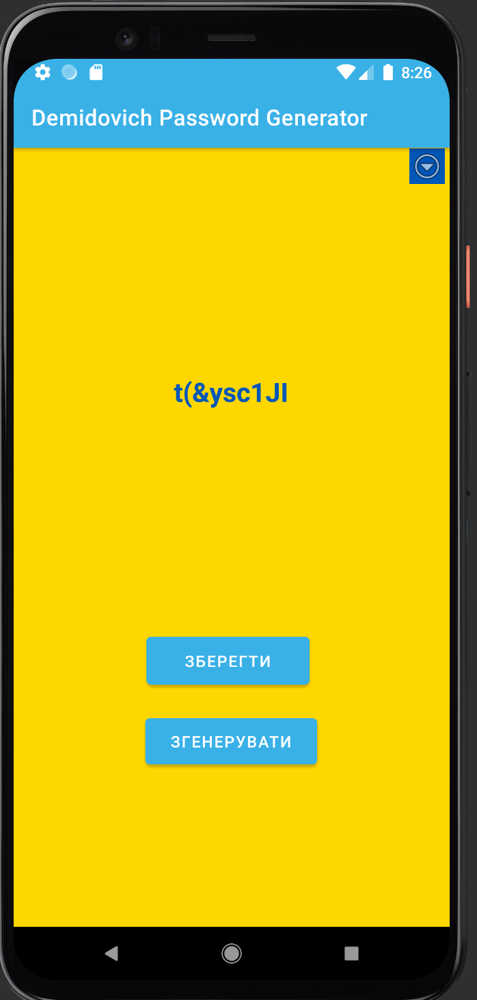
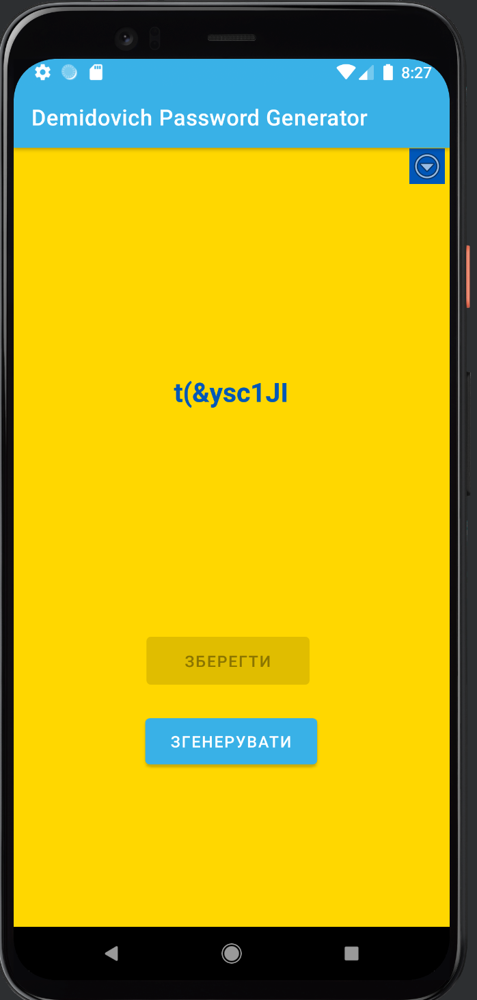
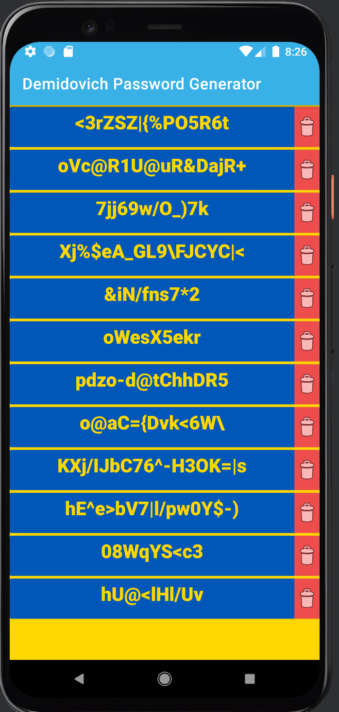

# PassForge - Password Security & Cybersecurity Academy

<p align="center">
  
</p>

<p align="center">
  <strong>Master Password Security Through Interactive Learning</strong>
</p>

<p align="center">
  <a href="https://play.google.com/store/apps/details?id=com.vtoptunov.passwordgenerator">
    
  </a>
  
  
  
  
</p>

---

## 🎯 Overview

**PassForge** is more than just a password generator - it's your personal cybersecurity training ground. Generate ultra-secure passwords, learn hacking techniques, and master online safety through engaging mini-games and real-world scenarios.

### 🌟 What Makes PassForge Unique

- **🎓 Cybersecurity Academy** - Learn by playing 15+ interactive games
- **🎲 5 Password Styles** - From random chaos to memorable passphrases
- **🛡️ Network Defense** - Tower defense game teaching real network security
- **🔒 Bank-Level Security** - SQLCipher encryption, no cloud storage
- **📱 QR Transfer** - Securely move passwords between devices
- **⚡ Live Crack Simulator** - See how fast your passwords can be cracked
- **🌙 Cyberpunk UI** - Beautiful matrix-inspired design
- **🔐 Biometric Lock** - Fingerprint/Face ID protection

---

## 🎮 PassForge Academy - Learn While You Play

Master cybersecurity through 15+ interactive games with infinite levels!

### 🏆 Available Now

#### 1. **Memory Match** 🧠
Train your brain to remember complex passwords. Progressive difficulty from Beginner to Expert.
- **Levels**: 1-1000+ (infinite)
- **Rewards**: 50-200 XP per level
- **Skills**: Memory training, pattern recognition

#### 2. **Password Cracker** 🔓
Understand why weak passwords are dangerous by cracking them yourself.
- **Levels**: 1-1000+ (infinite)
- **Mechanics**: Find weaknesses, use hints, beat the timer
- **Learn**: Dictionary attacks, brute force, common patterns

#### 3. **Phishing Hunter** 🎣
Spot fake websites and emails before they trick you.
- **Levels**: 1-1000+ (infinite difficulty scaling)
- **Features**: Real-world phishing examples, red flag identification
- **Master**: URL analysis, email verification, social engineering detection

#### 4. **Social Engineering** 🎭
Defend against psychological manipulation tactics.
- **Levels**: 1-1000+ (infinite scenarios)
- **Scenarios**: Pretexting, baiting, impersonation, tailgating
- **Skills**: Critical thinking, threat assessment

#### 5. **Network Defense** 🛡️ *(New!)*
Tower defense game where you build network security against cyber attacks.
- **Levels**: 1-1000+ (infinite waves)
- **Defenses**: Firewall, NAT, IDS, Antivirus, VPN, Honeypot, SIEM
- **Attacks**: 15 types (DDoS, Ransomware, Zero-day, APT, etc.)
- **Budget Management**: Strategic defense placement
- **Real Learning**: NAT, packet filtering, intrusion detection

### 🚀 Coming Soon

6. **App Permission Manager** 📱 - Learn which app permissions are safe
7. **WiFi Security Simulator** 📡 - Configure secure home networks
8. **Malware Scanner** 🦠 - Find hidden viruses in file systems
9. **2FA Authentication Quest** 🔢 - Enable two-factor everywhere
10. **Password Builder Challenge** 🏗️ - Create passwords to specifications
11. **Social Media Privacy Audit** 🔍 - Secure your online presence
12. **Data Breach Detective** 🕵️ - Investigate real historical hacks
13. **Encryption Escape Room** 🔐 - Solve cryptographic puzzles
14. **Digital Footprint Cleanup** 👣 - Erase your online traces
15. **Password Manager Tutorial** 🗝️ - Master password management

### 📚 Security Lessons

Interactive lessons covering:
- **Breach Detection** 🚨 - Recognize when you've been hacked
- **WiFi Security** - Secure your home network
- **Password Best Practices** - NIST guidelines
- **Two-Factor Authentication** - Why SMS isn't enough
- **Social Engineering Defense** - Spot manipulation tactics

---

## 🎨 Password Generation Styles

### 1. Random (Maximum Security)
```
K#9mP@2vQ$7nX!4aB
```
**Entropy**: 128+ bits | **Crack Time**: Billions of years

### 2. XKCD - Memorable & Secure
```
Correct-Horse-Battery-Staple-7453!
```
**Based on**: [XKCD #936](https://xkcd.com/936/) | **Easy to remember, impossible to guess**

### 3. Phonetic (Phone-Friendly)
```
Alpha-Bravo-9-Charlie-Delta
```
**Perfect for**: Phone verification, voice communication

### 4. Story-Based (Long-term Memory)
```
TheDog7AteMy8Homework!
```
**Memorable narratives** that create strong security

### 5. Pronounceable (Fast Typing)
```
Figlurty-Mabston-42
```
**Fake words** that sound real but are unique

---

## 🛡️ Military-Grade Security

### Encryption Stack
- **SQLCipher** - 256-bit AES database encryption
- **Android Keystore** - Hardware-backed key storage
- **EncryptedSharedPreferences** - Settings protection
- **Zero-knowledge architecture** - Even we can't see your passwords

### Privacy First
- ✅ **100% Offline** - No internet connection required
- ✅ **Zero Tracking** - No analytics, no telemetry
- ✅ **No Cloud Sync** - Everything stays on your device
- ✅ **Open Source** - Code available for audit
- ✅ **No Account Required** - Just install and use

### Password Health Dashboard
- Real-time strength analysis
- Duplicate password detection
- Old password warnings
- Breach database checks (coming soon)
- Entropy calculator

---

## 📱 QR Code Transfer

Securely transfer passwords between your devices:

1. **Select Passwords** - Choose what to export
2. **Generate QR Code** - Base64 + SHA-256 checksum
3. **Scan on New Device** - CameraX integration
4. **Verify & Import** - Checksum validation

**Security Features**:
- SHA-256 integrity verification
- Error correction Level H
- Max 2953 characters per QR
- No cloud upload required

---

## 📸 Screenshots

<p align="center">
  
  
  
</p>

<p align="center">
  
</p>

### 🎮 Password Generator
Modern cyberpunk interface with real-time crack time simulation and strength meter.

### 🏆 Academy Home
Gamified progression system with XP, levels, and unlockable games.

### 🛡️ Security Dashboard
Comprehensive overview of your password health and achievements.

### 📝 Password Manager
Encrypted password storage with search and organization features.

---

## 🏗️ Technical Excellence

### Modern Architecture
- **Clean Architecture** - Separation of concerns
- **MVVM Pattern** - Reactive view models
- **Jetpack Compose** - Declarative UI (1.6.0)
- **Kotlin Coroutines** - Efficient async operations
- **Hilt/Dagger** - Dependency injection
- **Room + SQLCipher** - Encrypted local storage
- **Kotlin 1.9.22** - Latest stable release

### Security Libraries
```kotlin
// Encryption
implementation 'net.zetetic:android-database-sqlcipher:4.5.4'
implementation 'androidx.security:security-crypto:1.1.0-alpha06'

// Biometric
implementation 'androidx.biometric:biometric:1.1.0'

// QR Codes
implementation 'com.google.zxing:core:3.5.2'
implementation 'com.journeyapps:zxing-android-embedded:4.3.0'

// Breach Checking
implementation 'com.github.Baqend:Orestes-Bloomfilter:2.2.2'
```

### Performance Optimizations
- Lazy loading of heavy components
- Efficient bitmap caching for QR codes
- Flow-based reactive streams
- Room database with indices
- Minimal main thread blocking

---

## 🎓 Educational Value

### What You'll Learn

**Beginner Level**:
- Password strength fundamentals
- Common attack vectors
- Basic encryption concepts

**Intermediate Level**:
- Network security architecture
- Social engineering tactics
- Phishing detection techniques

**Advanced Level**:
- Zero-day exploits
- Advanced Persistent Threats (APT)
- Cryptographic principles
- Security architecture design

### Real-World Skills
- Recognize phishing attempts
- Configure home network security
- Evaluate app permissions
- Enable proper 2FA
- Audit social media privacy
- Detect security breaches

---

## 📊 XP & Level System

### Player Progression
```kotlin
Level 1 → 2: 100 XP (total: 100)
Level 2 → 3: 150 XP (total: 250)
Level 3 → 4: 200 XP (total: 450)
Level 4 → 5: 250 XP (total: 700)
...
Formula: 25 × (level - 1) × (level + 2)
```

### Game Unlocking
- **Level 1**: Memory Match
- **Level 3**: Password Cracker
- **Level 5**: Phishing Hunter
- **Level 7**: Social Engineering
- **Level 10**: Network Defense

### Achievements System
- 🛡️ First Defense
- 🔥 Firewall Master (1000 blocks)
- 🍯 Honeypot Expert (100 catches)
- 💯 Perfect Defense (10 flawless levels)
- 🏆 Elite Defender (Level 100)
- ⚡ Speed Runner
- 💰 Budget Master

---

## 🆓 Free vs Premium

### Free Version
- ✅ Generate unlimited passwords
- ✅ Save up to 50 passwords
- ✅ Memory Match game (full access)
- ✅ Password Cracker (first 10 levels)
- ✅ Basic security dashboard
- ⚠️ Ads supported

### Premium ($4.99 one-time)
- ✅ **Everything in Free, plus:**
- ✅ Save unlimited passwords
- ✅ All 15 Academy games (infinite levels)
- ✅ Network Defense game
- ✅ Advanced security analytics
- ✅ QR password transfer
- ✅ All security lessons
- ✅ Offline breach checker (coming soon)
- ✅ **Zero ads, forever**
- ✅ Priority support
- ✅ Future features included

**Why One-Time?** No subscriptions, no hidden fees. Buy once, own forever!

---

## 🛠️ Installation

### System Requirements
- Android 8.0 (API 26) or higher
- 100 MB free storage
- Biometric sensor (optional)
- Camera (optional, for QR transfer)

### Download Options

#### Google Play (Recommended)
```
Coming Soon to Google Play Store
```

#### GitHub Releases
```bash
# Clone repository
git clone https://github.com/VadimToptunov/PassForge.git

# Build with Gradle
./gradlew assembleRelease
```

---

## 🔄 Version History

### Version 3.0.0 (Current)
- ✅ 5 password generation styles
- ✅ 5 Academy games with infinite levels
- ✅ Network Defense tower defense game
- ✅ QR code transfer system
- ✅ XP & progression system
- ✅ Biometric authentication
- ✅ Security lessons
- ✅ Cyberpunk UI redesign

### Version 3.1.0 (Next Release)
- 🔜 Breach Detection lesson
- 🔜 App Permission Manager game
- 🔜 WiFi Security Simulator
- 🔜 Malware Scanner game
- 🔜 Widget support
- 🔜 Offline breach database

---

## 🌍 Localization

Currently supported languages:
- 🇺🇸 English
- 🇷🇺 Russian (Русский)

Want to help translate? Contact us!

---

## 💬 Support & Community

### Get Help
- 📧 **Email**: vtoptunov88@gmail.com
- 🐛 **Bug Reports**: [GitHub Issues](https://github.com/VadimToptunov/PassForge/issues)
- 💡 **Feature Requests**: Always welcome!
- ⭐ **Star on GitHub**: Show your support!

### Contributing
We welcome contributions! Areas needing help:
- 🎮 New Academy game ideas
- 🌐 Translations
- 🎨 UI/UX improvements
- 🧪 Testing & bug reports
- 📝 Documentation

---

## 📜 License

**MIT License** - Free and open source!

```
Copyright (c) 2024 Vadim Toptunov

Permission is hereby granted, free of charge, to any person obtaining a copy
of this software and associated documentation files (the "Software"), to deal
in the Software without restriction, including without limitation the rights
to use, copy, modify, merge, publish, distribute, sublicense, and/or sell
copies of the Software, and to permit persons to whom the Software is
furnished to do so, subject to the following conditions:

The above copyright notice and this permission notice shall be included in all
copies or substantial portions of the Software.

THE SOFTWARE IS PROVIDED "AS IS", WITHOUT WARRANTY OF ANY KIND.
```

See [LICENSE](LICENSE) for full details.

---

## 👨‍💻 About the Developer

**PassForge** is an indie project by Vadim Toptunov, a developer passionate about privacy and education.

### Why PassForge Exists
- 😤 Tired of password managers that track users
- 🎓 Want to teach cybersecurity to everyone
- 🔓 Believe in transparent, honest software
- 🚫 No corporate interests, no data mining
- ❤️ Built for the community, not profit

### Philosophy
1. **Privacy is a right, not a luxury**
2. **Security through education, not fear**
3. **Open source is trustworthy source**
4. **One-time pricing is fair pricing**
5. **Learning should be fun**

---

## 🙏 Acknowledgments

Built with amazing open-source tools:
- **Jetpack Compose** - Android's modern UI toolkit
- **ZXing** - QR code generation & scanning
- **SQLCipher** - Database encryption
- **Room** - Local persistence
- **Hilt** - Dependency injection
- **Kotlin** - Beautiful language design

Inspired by:
- XKCD #936 (Password Strength)
- NIST Password Guidelines
- OWASP Security Principles
- Real-world security research

---

## 🎯 Project Goals

### Short Term (2024)
- [x] Launch on Google Play
- [x] 5 Academy games
- [x] Infinite level scaling
- [ ] 1,000 active users
- [ ] 4.5+ star rating

### Medium Term (2025)
- [ ] 10 additional Academy games
- [ ] Browser extension
- [ ] Desktop applications
- [ ] 10,000+ active users
- [ ] Community translations

### Long Term (2026+)
- [ ] Hardware key support
- [ ] Enterprise features
- [ ] Bug bounty program
- [ ] Security certifications
- [ ] 100,000+ users

---

## 📈 Statistics

```
Total Lines of Code: ~15,000
Compose Screens: 25+
Academy Games: 5 (15 planned)
Infinite Levels: Yes (1000+)
Supported Languages: 2
Database Tables: 3
Encryption: 256-bit AES
Security Audits: Coming Soon
```

---

<p align="center">
  <strong>🔐 Stay Secure. Learn Security. Become Security. 🔐</strong>
</p>

<p align="center">
  Made with ❤️ and ☕ for a safer internet
</p>

<p align="center">
  <a href="https://github.com/VadimToptunov/PassForge">⭐ Star on GitHub</a> •
  <a href="https://play.google.com/store">📱 Download on Play Store</a> •
  <a href="mailto:vtoptunov88@gmail.com">✉️ Contact</a>
</p>
